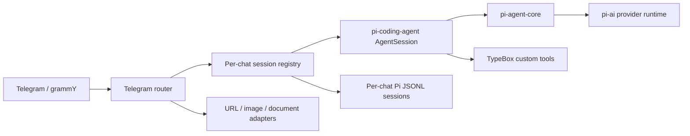

# TypeScript Migration Plan

## Goal

Reimplement `telegramagent` under `./apps/telegram-agent-typescript` with behavior-compatible Telegram handling while keeping the Python implementation available until the TypeScript service passes its parity checks.

Use Pi's native layers instead of rebuilding agent infrastructure:

- `@earendil-works/pi-ai` for model/provider and image APIs.
- `@earendil-works/pi-agent-core` for agent event and message types.
- `@earendil-works/pi-coding-agent` for per-chat sessions, persistence, steering, follow-up, retry, compaction, skills, and custom tools.

Use Biome for formatting and linting, TypeScript strict mode, grammY for Telegram, and Vitest for tests.

## Context

The Python application has about 15,700 lines across runtime and tests. It includes Telegram private/group routing, reply branches, durable sessions, agent steering, URL extraction, documents, images, Morsel, events, MCP, Gurume, and container tools. A staged migration reduces the risk of losing safety limits or subtle Telegram behavior.

The TypeScript implementation is isolated in `./apps/telegram-agent-typescript`. Python source, deployment files, and runtime data remain unchanged until cutover.

## Architecture

Each Telegram chat receives an isolated Pi session directory beneath `BOT_SESSION_LOG_DIR/<chat-id>/pi`. `SessionManager.continueRecent()` restores that chat only. The registry serializes session creation and delegates active-run messages to Pi's `steer` or `followUp` queues.

`DefaultResourceLoader` loads enabled Agent Skills but excludes maintainer-facing `AGENTS.md`. A Telegram-specific system prompt incorporates `SOUL.md` and capability information.

## Non-Goals

- Do not edit or delete the Python implementation during migration.
- Do not migrate existing Pydantic AI JSONL records in place. Add an explicit importer only if preserving old conversations becomes a deployment requirement.
- Do not expose Pi coding tools outside the configured container tool policy.
- Do not add ESLint, Prettier, or Vercel AI SDK.

## Plan

- [x] Create the Node/TypeScript/Biome/Vitest project in `./apps/telegram-agent-typescript`; evidence: dependency install and all local quality scripts pass.
- [x] Implement validated environment settings and redacted logging; evidence: Vitest covers defaults, CSV parsing, invalid ranges, and secret redaction.
- [x] Implement Pi model runtime, Telegram system prompt/resource loading, and isolated per-chat session registry; evidence: Pi session smoke test plus registry tests cover chat isolation, reuse, steering, follow-up, cancellation, reset, and passive context.
- [x] Implement Telegram private/group routing, commands, reply context, image input, status editing, output chunking, and allowlists; evidence: update-level grammY tests cover private routing, allowlist rejection, passive groups, concurrent cancellation, image failures, and Morsel long replies.
- [x] Port safe URL extraction and proactive handling; evidence: Pi tool rejects unsafe schemes/addresses/redirects, tests bounded built-in extraction, and falls back to the local TypeScript kabigon package for failures, blocker pages, and source-specific URLs.
- [ ] Port document conversion behind a bounded adapter; acceptance: supported-type, size, timeout, truncation, and failure tests pass.
- [ ] Port image generation through `pi-ai` where supported and retain an OpenAI-compatible fallback only when required; acceptance: disabled/configuration/provider/error paths pass tests.
- [x] Port Morsel publishing and long-reply routing; evidence: rich Pi tool and smart Telegram routing are implemented; tests cover publish payloads, capability URL validation, Instant View hash, and missing configuration.
- [ ] Port file events, task management, context reload, and skill installation commands; acceptance: command authorization and bounded queue/file tests pass.
- [ ] Port optional Firecrawl/Yahoo Finance integration and direct Gurume/container tools as Pi tools or extensions; acceptance: capability reporting and disabled/unavailable paths pass tests.
- [ ] Add TypeScript Docker/Compose deployment without replacing Python defaults; acceptance: image builds and starts with mounted skills, events, sessions, and SOUL.
- [ ] Run behavior parity review and cutover documentation; acceptance: all TypeScript quality gates pass and remaining intentional differences are documented.

## Risks

- Pi session JSONL differs from the current Pydantic AI session format. Keep stores separated and make cutover explicit.
- `OPENAI_BASE_URL` may target arbitrary OpenAI-compatible providers. Register a runtime provider with explicit compatibility metadata rather than assuming the built-in OpenAI endpoint.
- Remaining Python-only libraries (`firecrawl-anydoc`, `gurume`, `yfmcp`) may need Node alternatives, subprocess adapters, or temporary sidecars. Preserve timeouts and honest capability reporting.
- Telegram UTF-16 entity offsets and group reply branching are easy to regress. Keep dedicated fixtures and parity tests.
- Pi coding tools have broad filesystem/process access. Disable built-ins by default and only enable bounded container tools after policy parity is implemented.

## Rollback / Recovery

The Python application remains untouched and deployable throughout migration. TypeScript uses its own package files and Pi session subdirectories. Rollback consists of stopping the TypeScript service and restarting the existing Python Compose service; no Python session data is rewritten.

## Completion Checklist

- [x] `npm run format:check`
- [x] `npm run lint`
- [x] `npm run typecheck`
- [x] `npm test` (46 bot tests and 97 kabigon tests)
- [x] `npm run build`
- [ ] TypeScript container build succeeds. Docker CLI is unavailable in the current WSL environment, so this requires external verification.
- [ ] README documents local run, configuration, session-format difference, migration, and rollback.
- [ ] Python and TypeScript services are not configured to consume the same Telegram update stream simultaneously.
- [ ] Maintainer accepts the documented parity gaps or all gaps are closed.
